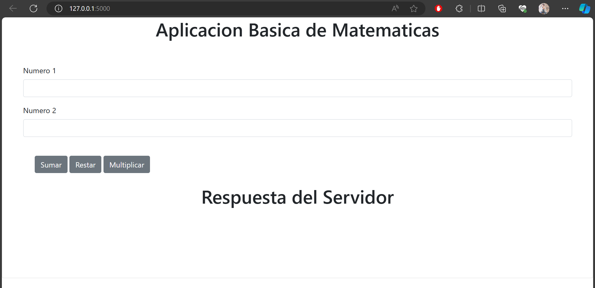

# Building and Deploying a Web App using Flask
This is the repository for Building and web deploying applications using Flask.


This is a simple web application that performs basic mathematical operations (addition, subtraction, multiplication) on two numbers entered by the user.

## Use

1. Clone the repository:

     ```bash
     git clone https://github.com/Anyel-ec/Flask-Maths-Add-Subtraction-Multiplication.git
     ```

2. Install the dependencies:

     ```bash
     pip install -r requirements.txt
     ```

3. Run the application:

     ```bash
     python app.py
     ```

4. Open your browser and visit `http://localhost:5000` to use the application.

## Links

- [Anyel Ec's LinkedIn](https://www.linkedin.com/in/anyel-ec/)

---

## Example Code

###HTML

```html
<!DOCTYPE html>
<!-- Your HTML code here -->
</html>
```

### Python (app.py)

```python
from flask import Flask, render_template, request
from Maths.mathematics import summation, subtraction, multiplication

# Rest of Flask code here

#Mathematical functions here
```

---

Any questions or concerns, feel free to [contact me on LinkedIn](https://www.linkedin.com/in/anyel-ec/).